# 1일차 
 
**목표 : Jenkins 를 설치하고 CI 환경을 구성한다.**  


##  VM 생성  

### kt cloud 에서 VM ( Ubuntu 18.04 ) 을 생성한다. 
  기준 : 8 core , 16G  
  설치 예정
  ```
   jenkins , k3s , ArgoCD , Pinpoint 등
  ```

서버 -> 서버 메뉴 이동 후  Create Server 선택  
zone은 KOR-Seoul M2 선택 후 서버 이름을 입력하고 사양을 선택한다.  

오른쪽 하단에 Launch를 클릭하여 vm을 생성한다. 

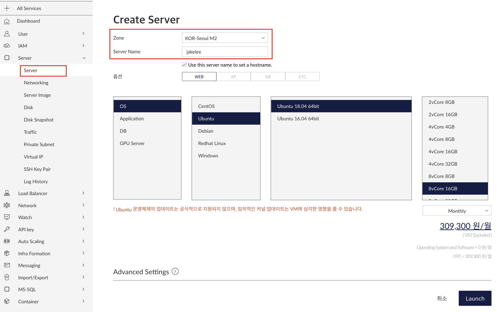

5분정도 경과하면 Alarm 아이콘에  vm생성 및 root 비밀번호를 확인 할 수 있다.  
비밀번호는 반드시 저장한다. 

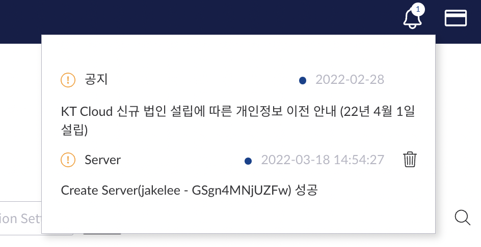  


### Private IP를 생성 한다.   
zone은  VM 생성 했던 존을 선택한다. ( KOR-Seoul M2 )

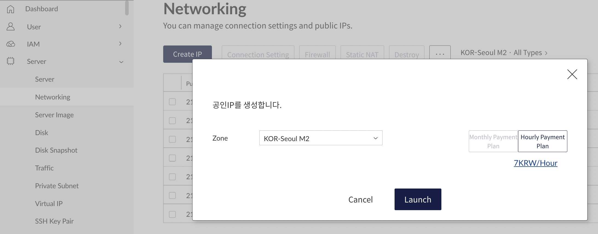

Launch 를 클릭하면 IP가 생성이 된다.  
  


생성된 IP의 오른쪽 끝을 클릭하여 식별할 수 있는 이름을 만들어준다.

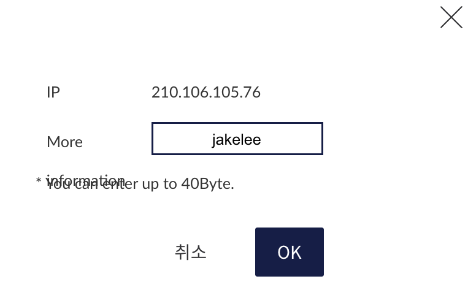

변경 완료

 
### Port Forwarding 설정한다.
VM 과 Private IP를 매핑하면 외부에서 접속 가능 하다.  

서버를 선택하고  Connection String을 선택한다.


- 사설 포트 : vm 서버의 포트  
- 공인 포트 : 외부에 노출할 포트  
- 공인 IP : 외부에서 접속할 IP ( 위에서 생성한 Private IP ) 


추가 버튼을 클릭하여 생성하고 아래 포트들도 반복하여 설정한다.

```
ssh : 22 -> 22222
jenkins : 9000 -> 9000
flask web : 40003 -> 40003
k8s  : 8443 -> 8443
```

### 터미널 프로그램으로 서버에 접속하고 비밀번호를 변경한다.
   Mac 에서는 Iterm2, 윈도우는 Putty 추천  

터미널에서 아래 명령어를 입력하여 로그인 한다.  
로그인 후  connecting 저장 질문이 나오면 yes.  

```bash
ssh root@(본인 private ip) -p 22222
``` 


비밀번호 입력 후 아래 명령어 실행하여 root 비밀번호를 변경한다.
```bash
passwd
```
```bash
Enter new UNIX password:
```

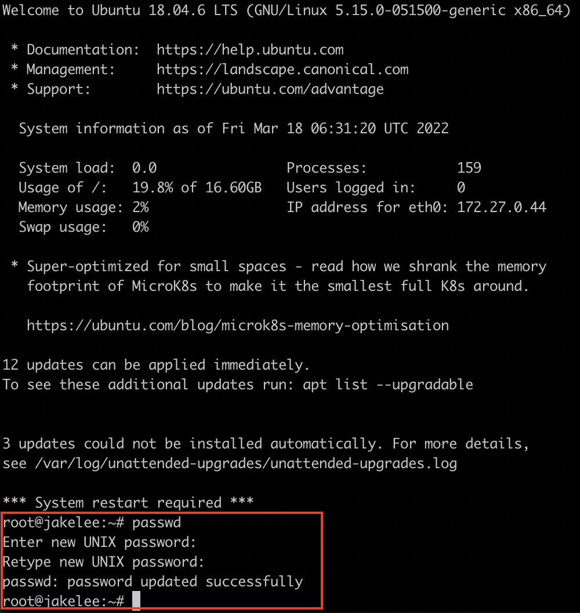

   * 기존 비밀번호 물어 보는 경우도 있음
   
## Jenkins를 설치한다 ( https://velog.io/@ifthenelse/jenkins-설치하기-ubuntu-20.04 )
### 저장소 키 다운로드
   ```bash
   wget -q -O - https://pkg.jenkins.io/debian/jenkins.io.key | sudo apt-key add -
   ```
   제대로 입력 되었는지 확인 한다.
   ```bash
   echo deb http://pkg.jenkins.io/debian-stable binary/ | sudo tee /etc/apt/sources.list.d/jenkins.list
   ```
### 패키지 인덱스를 업데이트 하고 라이브러를 최신 버전으로 올려준다.
   
   ```bash
   apt-get update && apt-get upgrade
   ```
   중간에 계속 진행하는 것을 물어보면 Y 를 입력하여 진행 


### root 계정이라면 아래와 같이 Jenkins 를 설치한다.  
현재 VM은  java가 설치되지 않아 openjdk 도 추가적으로 설치한다.
   ```bash
   apt-get install jenkins openjdk-8-jdk
   ```
   
   일반 계정이면 앞에 sudo 명령어를 반드시 붙여준다
   ```bash
   sudo apt-get install jenkins openjdk-8-jdk
   ```
   
### Jenkins 서비스 포트를 변경한다.  

   아래 화일을 vi 에디터를 사용하여 포트를 변경 ( 8080 ->  9000 )

   ```bash
   vi /etc/default/jenkins 
   ``` 
   ```bash
   HTTP_PORT=9000
   ```
   
   < vi에디터 사용법 >
   ```
   i : 데이터 입력모드
   ```
   ```
   esc : 명령모드
   ```
   ```
     / : 찾기
     x : 한글자 삭제
     dd : 한 라인 삭제
     :wq : 저장하고 나오기
     :q! : 저장안하고 나오기
     :set nocp : 라인 밀리는 현상 방지
   ``` 
    
### 서비스 재시작 및 상태 확인
```
service jenkins restart
```
정상여부 확인
```
systemctl status jenkins
```
아래와 같이 active(running) 이면 정상  


- ctrl + c 를 눌러 해당 화면에서 나온다.
  

### admin 초기 패스워드 확인 및 복사
 아래 명령어를 사용하여 password 를 복사하고 저장해 놓는다.

```
cat /var/lib/jenkins/secrets/initialAdminPassword
```
   
### 젠킨스 서버 접속
이제 브라우져로 http://(본인서버ip):9000으로  접속하면 아래와 같은 화면이 나온다.  
패스워드에 위 명령으로 확인한 문자열을 입력한다.  

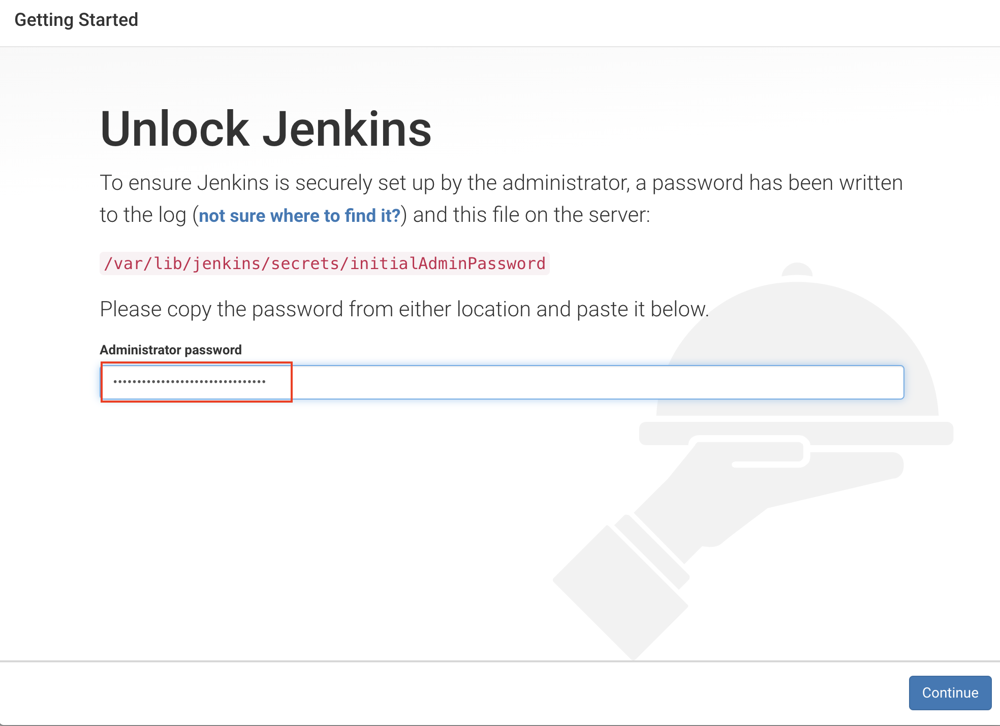

Install Suggested Plugin 선택하고 Plugin 설치 한다.
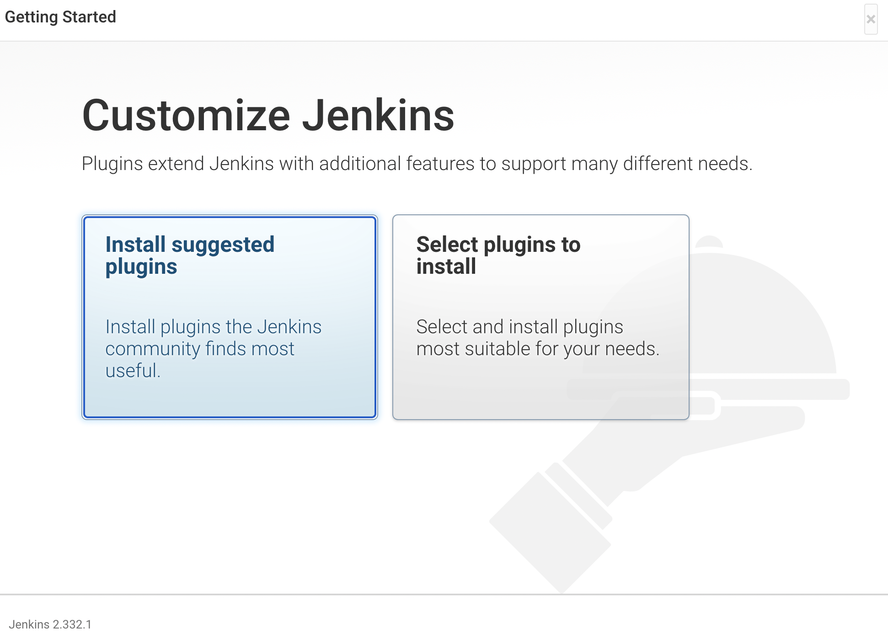

다운로드를 시작한다. 네트웍 상황에 따라 시간이 많이 소요 될 수 있다.


아래 와 같이 화면이 나오면 성공.
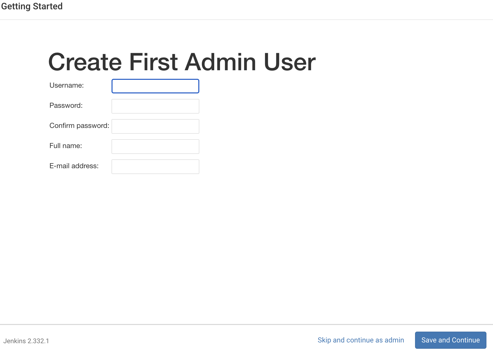

Admin 유저를 생성한다. 이메일은 아무값이나 넣어준다.  
save and continue 버튼을 클릭한다


save and Finished 버튼을 클릭한다.
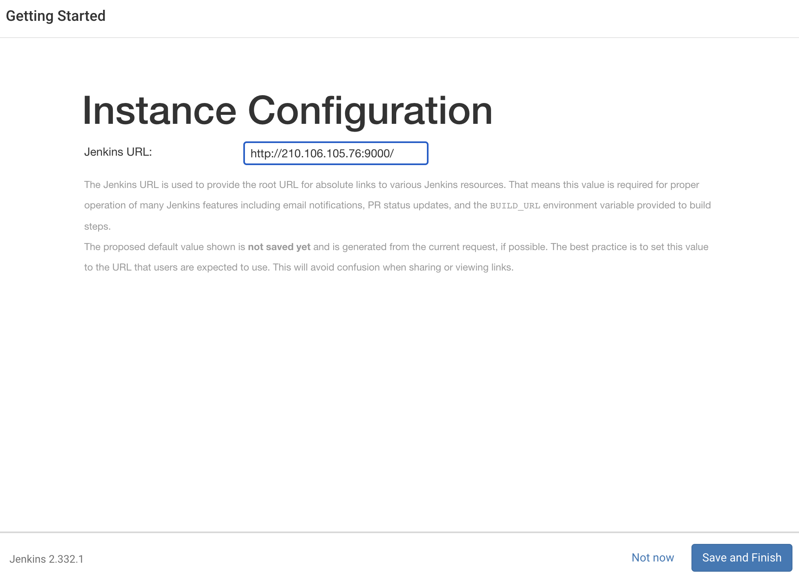

설정 완료가 되면 아래 화면이 나오고 Jenkins를 시작 할 수 있다.  

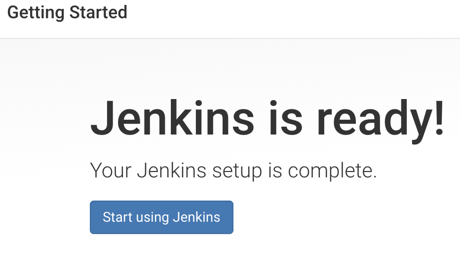  

- 해당 문서는 영문을 기준으로 하며 Jenkins는 브라우저의 언어를 따른다. 

### 추가 플러그인 설치

Manage Jenkins 메뉴 선택  

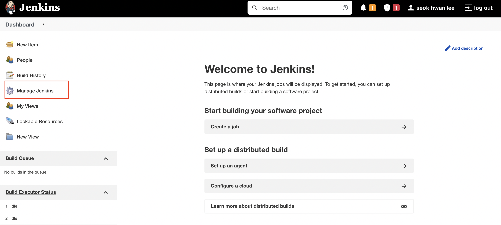  

Manage Plugin 선택

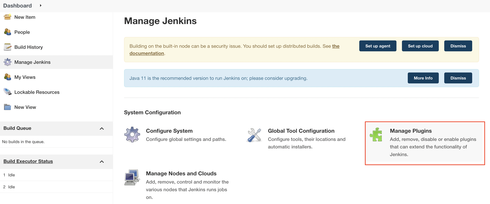  


Available Tab 이동하여 git으로 검색 한다.   
Git Parameter , GitHub Integration 선택  
docker 로 검색 후 	Docker Pipeline , docker-build-step 선택  
Download now and install after restart 클릭

  

아래와 같이 설치가 진행이 되고 Restart Check 를 하여 Jenkins를 재기동 한다

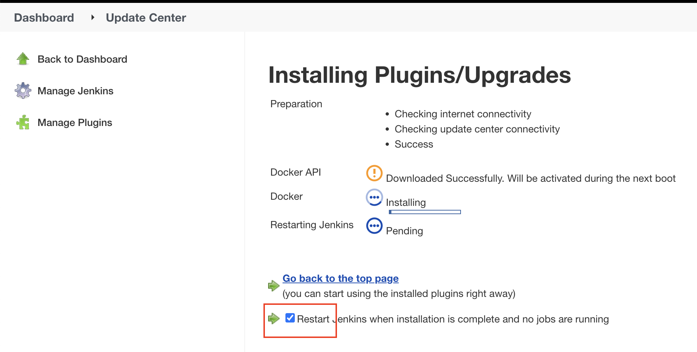  

Jenkins restarting이 되고 다시 로그인을 한다.  

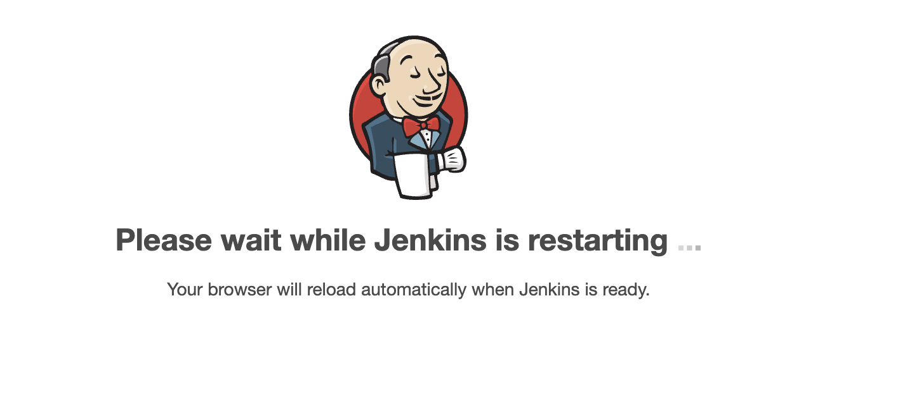  


## Docker 를 설치한다 ( https://shanepark.tistory.com/237 )

### 패키지 인덱스 업데이트
```
apt-get update
```
### HTTPS를 통해 repository 를 이용하기 위해 package 들을 설치
```
apt-get -y install  apt-transport-https ca-certificates curl gnupg lsb-release
```
### Docker의 Official GPG Key 를 등록합니다.
```
curl -fsSL https://download.docker.com/linux/ubuntu/gpg | sudo gpg --dearmor -o /usr/share/keyrings/docker-archive-keyring.gpg
```
### stable repository를 등록합니다.
```
echo \
"deb [arch=amd64 signed-by=/usr/share/keyrings/docker-archive-keyring.gpg] https://download.docker.com/linux/ubuntu \
$(lsb_release -cs) stable" | sudo tee /etc/apt/sources.list.d/docker.list > /dev/null
```  
### 도커를 설치합니다.
```
apt-get update && apt-get install docker-ce docker-ce-cli containerd.io
```
### 도커 버전을 확인합니다.
```
docker --version
```
  

### 도커 이미지 다운로드 및 실행하기
```
docker run hello-world
```
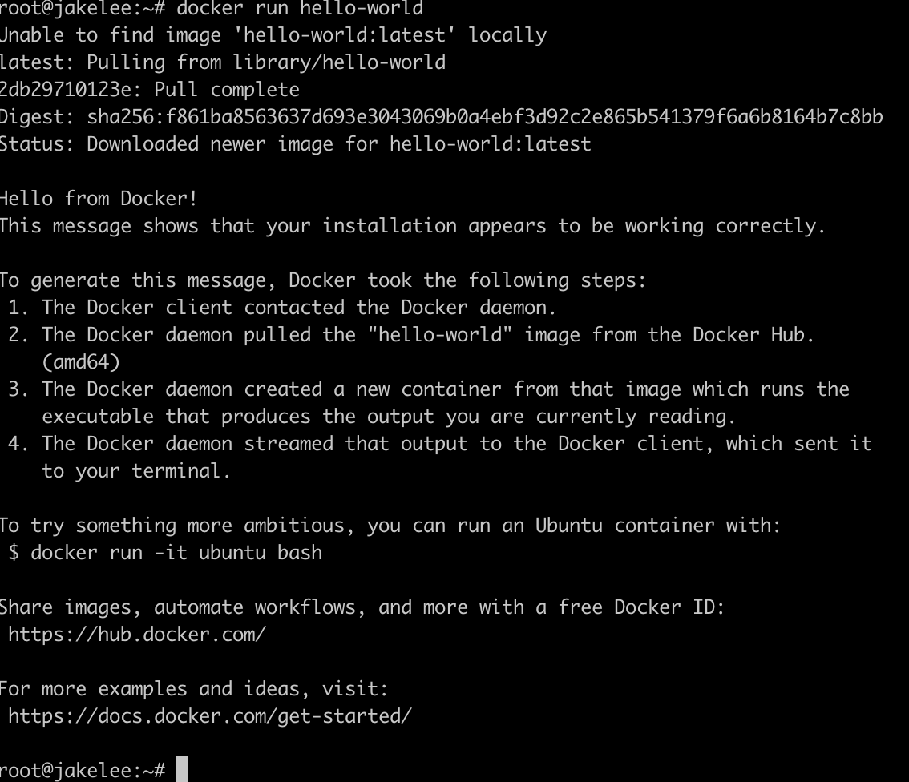  

### 젠킨스의 pipeline 으로 docker 를 실행하기 위해 권한을 부여한다.

/usr/bin/docker 의 사용자그룹을 jenkins 에 추가해준다  

```bash
usermod -aG docker jenkins
```
jenkins를 재시작 해준다.

```bash
service jenkins restart
```

## GitHub 계정을 생성한다. 
   
### https://github.com/ 접속하고 계정 생성 ( 향후 사내에서 개발시는 d-space GitLab 사용 
### Repository를  생성한다.
아래와 같이 이름 입력를 하고 Readme check 를 한다
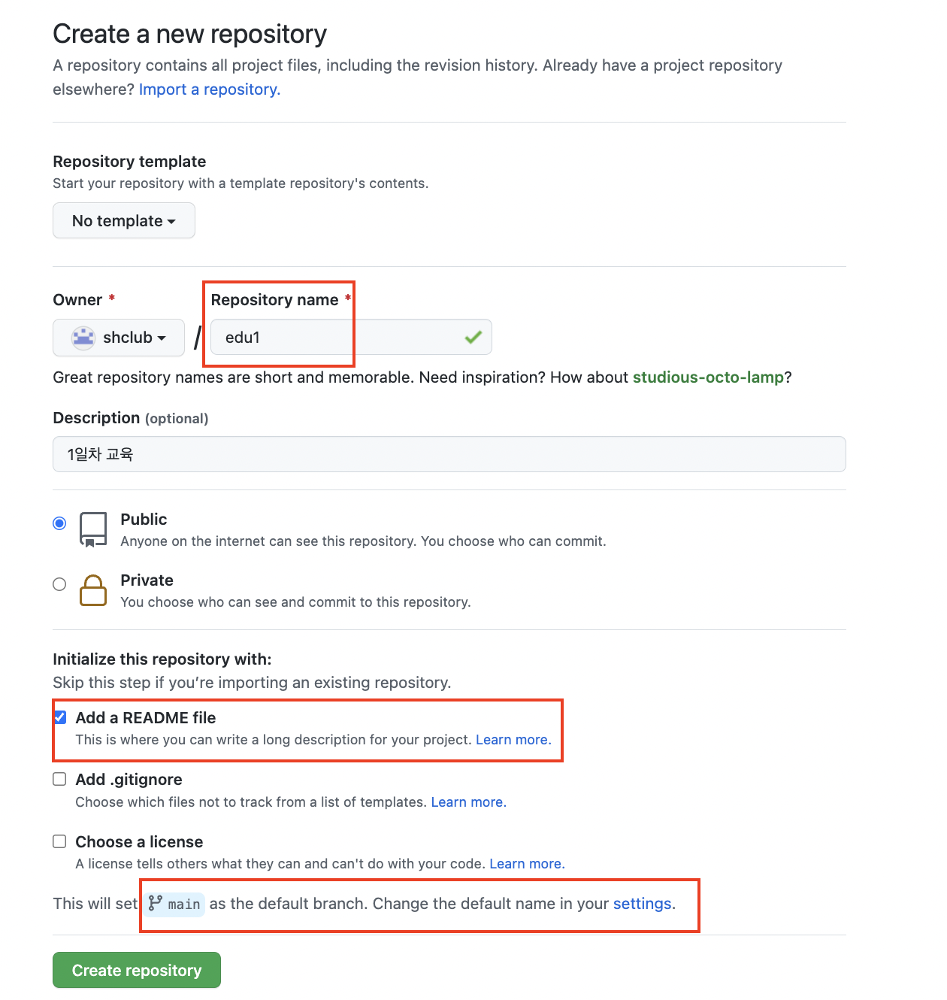


default 브랜치를 main에서 master로 변경한다.
   
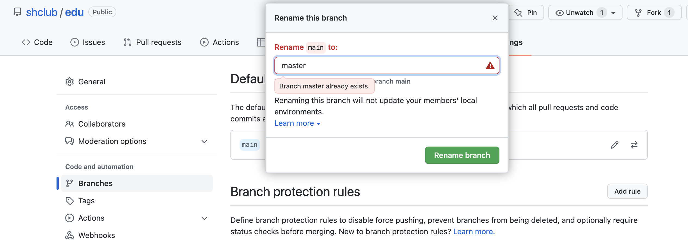


### https://github.com/shclub/edu 폴더의 파일을 복사하여 본인이 생성한 Repository에 신규 화일을 생성한다. 
총 4개 화일을 만들고 내용을 복사한다.  향후 Git 사용법 교육 후 Git Clone 사용


   - 샘플은 pyhon flask 로 구성
   
##  Docker Hub 계정을 생성한다. 

### https://hub.docker.com/ 접속하고 계정 생성(향후 사내에서 개발시는 d-space Nexus 사용)  

### Docker 연동 테스트를 한다.

```
docker tag hello-world (본인id)/hello-world
docker push (본인id)/hello-world  
```

- 권한 에러 발생시 docker login 한다
```
docker login 
```

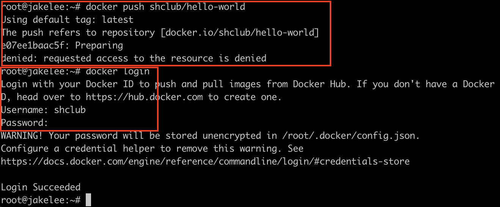

정상적으로 로그인후 push를 한다.

```
docker push (본인id)/hello-world  
```     


도커허브 본인 계정에서 도커 이미지 생성 확인


도커 이미지가 Private으로 되어 있으면 Public 으로 변경한다. 
- 개인 계정은 1개의 private 만 가능

setting 으로 이동하여 Make public 클릭후 repository 이름을 입력후 Make Public 클릭
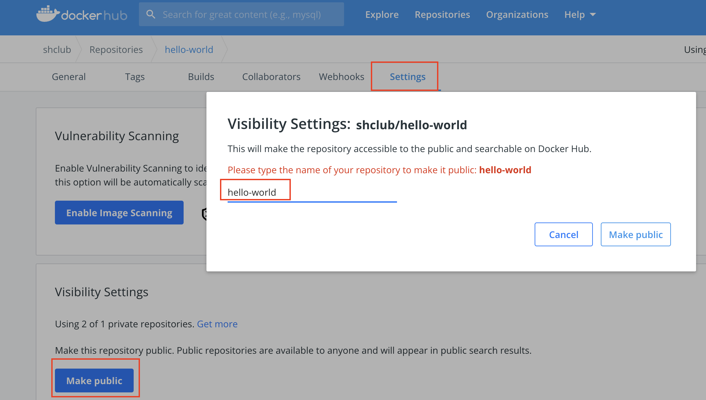

## Jenkins 설정 ( https://cwal.tistory.com/21 )
   ```
   7.1) 일반 사용자 계정을 생성한다 ( https://hongddo.tistory.com/121 )
        Manage Jenkins -> Manage Users  로 이동한다. 사용자 생성 버튼 클릭 후 사용자 생성.
        
        계정 별 권한 부여방법
        Configure Global Security로 이동하여 생성한 계정을 입력하고 Add 클릭
        추가후 권한 설정은 일단 Ovrall 체크 후 저장.
        
        
   7.2) github token 생성하기.
        
        jenkins 에서 github repository 인증을 위해 사용할 token 을 생성한다.
        settings - Developer settings - Personal access tokens - Generate new token 선택해서 토큰 생성
        repo, admin:repo_hook 만 체크하고 생성한다
        
   7.3) Credential을 생성한다.
        
        Manage Jenkins -> Manage Credential -> System -> Global Credential  로 이동한다.
        Add Credential를 클릭하면 계정 설정하는 화면이 나온다.
        Kind는  Username with password 를 선택해주시면 됩니다
        Username 은 본인의 Github/Docker 아이디를 선택해주시면 됩니다 ( 이메일 아님 )
        ID는 본인이 원하는 식별자를 넣어준다.
        
        
        github 계정 생성
        password는 이전에 발급받은 Github Token 값을 복사해주시면 됩니다. 
        
        * github 비밀번호 입력하면 안됨
        
        도커 계정
        도커 비밀번호는 도커 계정 비밀번호를 입력한다.
        
   7.4) 파이프 라인을 구성한다.
        
        메인 화면 좌측 메뉴에서 새로운 Item 선택
        
        item 이름을 입력하고 Pipeline 을 선택 후에 OK
        
        Build Triggers - GitHub hook trigger for GITScm polling 선택
        
        https://github.com/shclub/edu.git
        
        파이프 라인을 아래와 같이 설정한다.
        
        Repository URL 은 위에서 사용한 저장소 url 을 입력한다.
        
        branch 는 실제 github 저장소에 push 되었을 때 배포가 이루어질 branch 를 선택한다.
        
        Script Path 는 github 저장소의 Jenkinsfile 의 경로를 적어준다.
        
        credential에는 github 계정을 넣어준다.

   7.5) 빌드 실행
   
   7.6) Docker pull 및 실행 테스트
        docker pull shclub/edu
        docker run -p 40003:8080 shclub/edu
        브라우저에서 http://(본인ip):40003 호출하여 Hello World 확인
   
   ```
   * 과제 : github webhook를 통한 빌드 자동화

